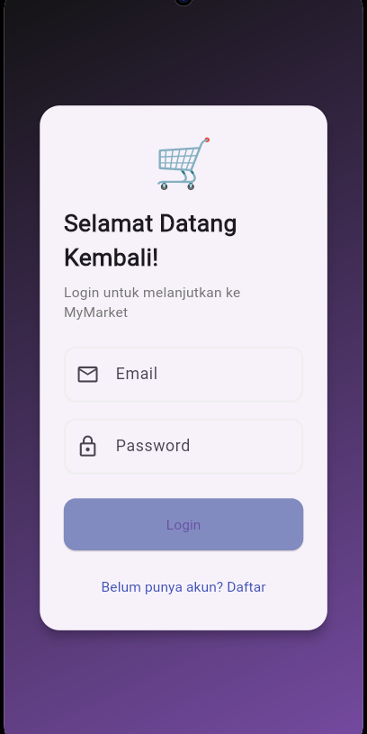
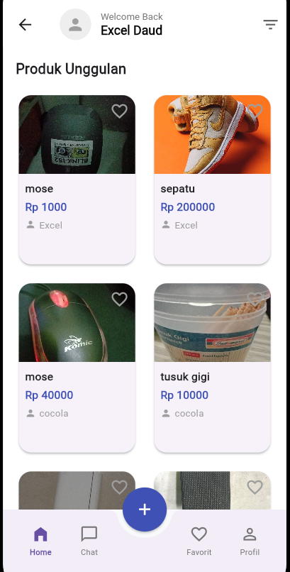
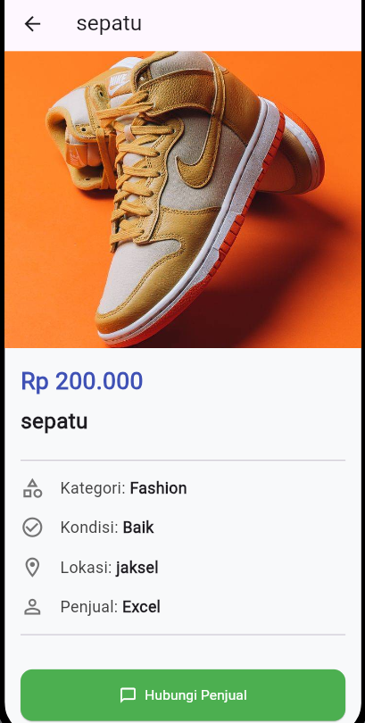

# 📱 Marketplace Mahasiswa

Marketplace Mahasiswa adalah aplikasi mobile berbasis Flutter yang memungkinkan mahasiswa untuk melakukan jual-beli barang kebutuhan kampus seperti buku, alat tulis, elektronik, dan lainnya.

# 📄 Lebih Lengkap?

[Klik di sini](https://dent-bag-f72.notion.site/MyMarket-23e40d42b1ed808497a7f9e31dafb2a5?source=copy_link)

---

## 📸 Screenshots

| Halaman | Tampilan |
|--------|----------|
| Login |  |
| Dashboard |  |
| Detail Produk |  |

---

## 📁 Directory Structure

lib
│───main.dart    
└───src
    │───config
    |    └──route.dart
    │───model
    │    │──category.dart
    |    │──data.dart
    |    └──product.dart
    │───pages
    |    │──homePage.dart
    |    │──mainPage.dart
    |    │──product_detail.dart
    |    └──shoping_cart_page.dart
    │───theme
    |    │──light_color.dart
    |    └──theme.dart
    └───widgets
         │──BottomNavigationBar
         |   |──bootom_navigation_bar.dart
         |   |──bottom_curved_Painter.dart
         |   └──centered_elasticIn_curve.dart
         |──bottom_navigation_bar.dart
         |  customRoute.dart
         |  prduct_icon.dart
         │──product_card.dart
         └──title_text.dart

---

## 📦 Fitur Aplikasi

- Login pengguna
- Menambahkan produk
- Menampilkan daftar produk
- Detail produk
- CRUD produk (Create, Read, Update, Delete)

---

## 📥 Download APK

Kamu bisa mengunduh aplikasi versi .apk di link berikut:

👉 [Download APK](https://github.com/ExceldaudMassi-Star/marketplace_mhs/releases/download/Beta/Marketplace_Mhs.apk)

---

## 🚀 Teknologi yang Digunakan

- Flutter
- Firebase Firestore
- Dart

---

## 🙌 Kontributor

- [Excel Daud](https://github.com/ExceldaudMassi-Star)
- [Daniel Marvelino Septian](https://github.com/vlinno)
- [Kalistowe Bie](https://github.com/kalistow)

# marketplace_mhs

A new Flutter project.

## Getting Started

This project is a starting point for a Flutter application.

A few resources to get you started if this is your first Flutter project:

- [Lab: Write your first Flutter app](https://docs.flutter.dev/get-started/codelab)
- [Cookbook: Useful Flutter samples](https://docs.flutter.dev/cookbook)

For help getting started with Flutter development, view the
[online documentation](https://docs.flutter.dev/), which offers tutorials,
samples, guidance on mobile development, and a full API reference.